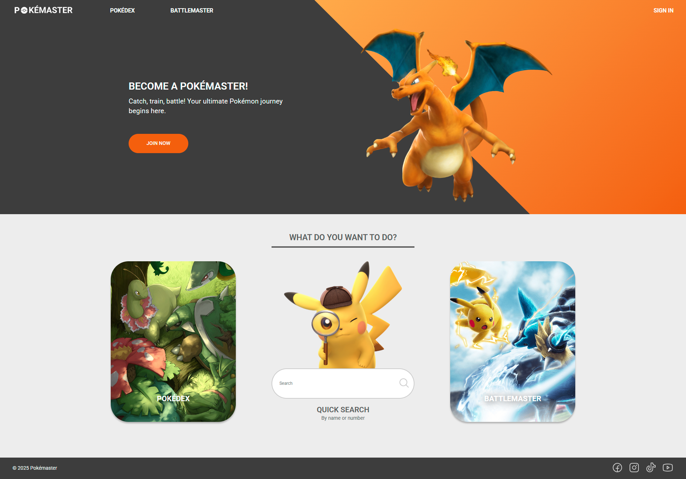

# Pokémaster - Frontend Eindopdracht

## Inhoudsopgave

1. [Inleiding](#1-Inleiding)
2. [Benodigdheden](#2-benodigdheden)
3. [Installatiehandleiding](#3-installatiehandleiding)
4. [Registreren en inloggen](#4-registreren-en-inloggen)
5. [Overige commando's](#5-overige-commandos)

## 1. Inleiding

Vind jij het ook zo overweldigend om de beste strategieën en teamcombinaties te kiezen voor gevechten in Pokémon
spellen? Of vind je het tijdrovend om de juiste informatie over moves en Pokémon types te zoeken? **Pokémaster** schiet
je te hulp! Met **Pokémaster** kan je door alle bestaande Pokémon heen scrollen, zoeken naar specifieke Pokémon en hun
informatie inzien, je favoriete Pokémon beheren en de ideale tegenstander vinden.



## 2. Benodigdheden

Om de applicatie te kunnen draaien, heb je het volgende nodig:

- **Een IDE**, zoals WebStorm.
- **Node.js** en **npm**
- <a target="_blank" href="https://github.com/terridb/frontend-eindopdracht-pokemaster">**De GitHub repository**</a>

De applicatie vereist de onderstaande dependencies, elk met een opgegeven minimale versie:

- @phosphor-icons/react: 2.1.7
- axios: 1.8.4
- jwt-decode: 4.0.0
- react: 19.0.0
- react-dom: 19.0.0
- react-hook-form: 7.55.0
- react-router-dom: 7.3.0
- remove-accents: 0.5.0

De gebruikte API, **<a target="_blank" href="https://pokeapi.co/docs/v2">PokéAPI</a>**, is gratis en open voor gebruik.
Er is geen authenticatie vereist, een API-key is dus niet nodig.

## 3. Installatiehandleiding

**Stap 1**: Zorg ervoor dat **<a target="_blank" href="https://www.jetbrains.com/webstorm/">WebStorm</a>** (of een
andere IDE
naar keuze), <a target="_blank" href="https://nodejs.org/en/download/">**Node.js** en **npm**</a> geïnstalleerd zijn
op je systeem. Check of Node.js en npm correct geïnstalleerd zijn door de volgende commando's in de terminal in te
voeren:

```shell
node -v
```

```shell
npm -v
```

De installatie is goed gegaan als de terminal een versienummer terugkoppelt.

**Stap 2**: Clone de Github repository met behulp van onderstaande SSH link naar jouw locale machine.

```shell
git@github.com:terridb/frontend-eindopdracht-pokemaster.git
```

Indien je WebStorm gebruik:

1. Ga naar File > New > Project from version control...
2. Vul bovenstaande link in
3. Druk op Clone

Indien je een andere IDE gebruikt, raadpleeg de instructies van deze IDE om deze repository te kunnen clonen.

**Stap 3**: Installeer de npm dependencies door het volgende commando in de terminal te runnen:

```shell
npm install
```

**Stap 4**: Start de applicatie door het volgende commando in de terminal te runnen:

```shell
npm run dev
```

Dit start de ontwikkelserver, wijzigingen zijn hierin direct zichtbaar. Na het uitvoeren van het commando, geeft de
terminal een webadres terug. Standaard is dat: http://localhost:5173/. Klik op deze link om de applicatie in
je browser te openen.

## 4. Registreren en inloggen

Voor het registreren en inloggen wordt
de <a target="_blank" href="https://github.com/hogeschoolnovi/novi-educational-backend-documentation">Novi Educational
Backend</a> gebruikt. De database met gebruikers wordt vaak binnen één uur weer geleegd. Daarom is er geen account
standaard beschikbaar en zal deze zelf aangemaakt moeten worden. Voor het registreren is er een e-mailadres,
gebruikersnaam en wachtwoord nodig.

## 5. Overige commando's

- **npm run build**: door onderstaande commando in de terminal te runnen wordt er een productieversie gemaakt van de
  applicatie:

```shell
npm run build
```

- **npm run preview**: door onderstaande commando in de terminal te runnen wordt er een lokale server gestart waarin je
  bovenstaande gemaakte productieversie kan bekijken. Standaard is dit webadres: http://localhost:4173/

```shell
npm run preview
```